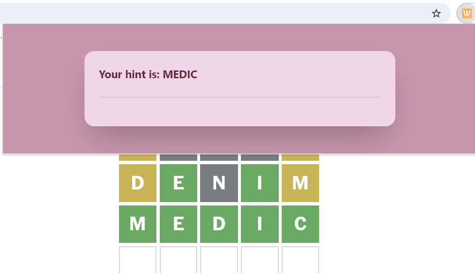

## Purpose

This is really just a demo but someone who gets stuck on wordle might find it useful.
## Getting started

- Download the code as a zip and extract it to a folder.
- In chrome click on Manage Extensions > Load Unpacked
- Select the folder you extracked it to